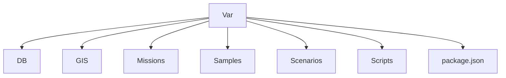
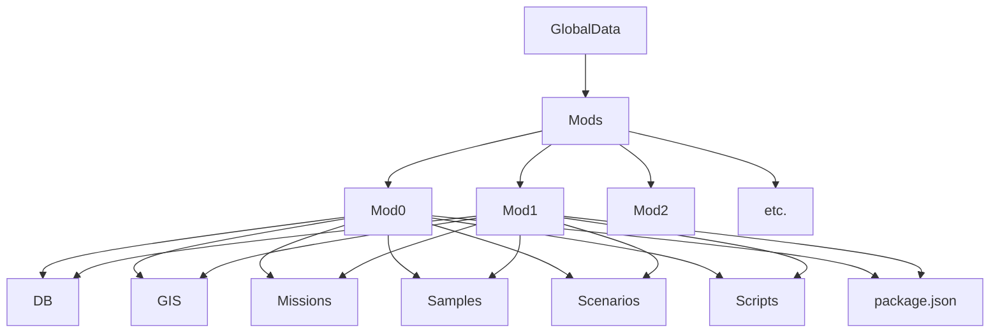

# Modding

## Description 

A C# tool that will provide in your game the ability of having modding and to your users the possibility to easily change all kinds of assets.

## Folder Structure

The var folder will act as a fallback. Ιn case there are no mods or they don't meet the conditions, the assets from the var folder will be displayed.

The Mods folder is where the mods should be to work properly. Each mod folder should have the same structure as the var folder. If the mod passes the evaluation and is active, the asset from the mod folder will be displayed , on the contrary if there is no mod or none is active, then the asset from the var folder will be displayed.

In order for a mod package to be valid, only one package.json file should be included in the root of its folder with the following JSON format...

{

  "name": "my_package",
  
  "description": "",
  
  "author": "",
  
  "version": "1.0.0",
  
  "supported": "^1.0.2"
  
}

We check if the version from the mod is the same as the version of the game and if the supported version is not exceed the acceptable version range. In case it doesnt apply the previous, the mod will not be valid.
